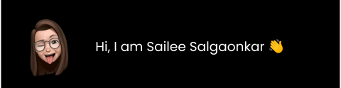

  
  

    <h3>About me : </h3>
    
🎓 I am currently pursuing my B.E in Information Technology 💻 at TSEC.

    
💼 I have worked as 🌐 website developer intern at few companies and looking for opportunities to solve real world problems🌟

    
  

  

  <h3>Currently working on: </h3>
    
  <ul>
    <li><h5> vALGO</h5>
      This gui helps students to visualize various traversal and operations performed on data structure through amazing animations. 
        <a href="https://github.com/sailee14032000/vALGO">Check it out</a>
    </li>
  </ul>
  

  

    <h3>Find me at:</h3>
    
    
  

  
  

<!--
**sailee14032000/sailee14032000** is a ✨ _special_ ✨ repository because its `README.md` (this file) appears on your GitHub profile.

Here are some ideas to get you started:

- 🔭 I’m currently working on ...
- 🌱 I’m currently learning ...
- 👯 I’m looking to collaborate on ...
- 🤔 I’m looking for help with ...
- 💬 Ask me about ...
- 📫 How to reach me: ...
- 😄 Pronouns: ...
- ⚡ Fun fact: ...
-->
